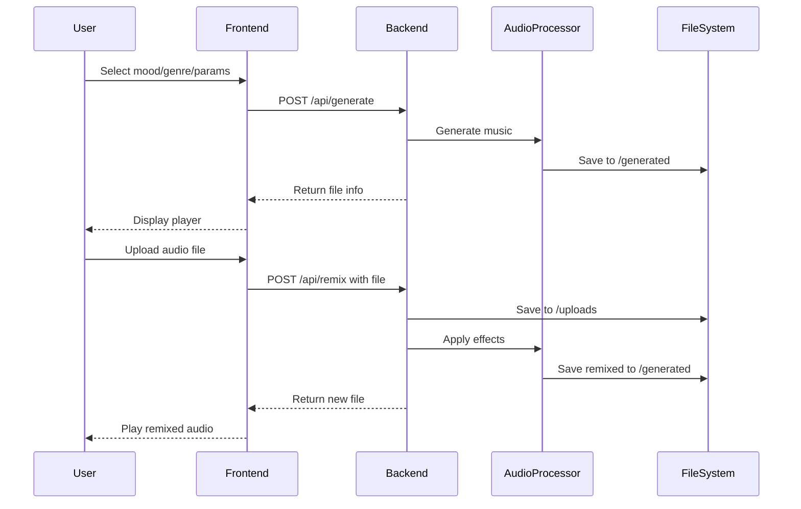
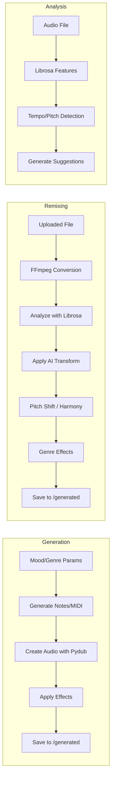

# 🎵 AI Music Remix & Mood Generator

[](https://reactjs.org/)
[](https://flask.palletsprojects.com/)
[](https://tailwindcss.com/)
[](LICENSE)

A powerful web application that allows students and music enthusiasts to create and remix music using AI - **no technical skills or musical expertise required!**

---

## 📑 Table of Contents
- [Features](#features)
- [System Architecture](#system-architecture)
- [Technology Stack](#technology-stack)
- [Project Structure](#project-structure)
- [Getting Started](#getting-started)
- [How to Use](#how-to-use)
- [API Endpoints](#api-endpoints)
- [Audio Processing Pipeline](#audio-processing-pipeline)
- [Educational Value](#educational-value)
- [Troubleshooting](#troubleshooting)
- [Contributing](#contributing)
- [License](#license)

---

## ✨ Features

### 🎼 AI Music Generation
- **Mood-Based Creation**: Generate music that matches your emotions
  - Happy 😊 | Sad 😢 | Energetic ⚡ | Calm 😌 | Dark 🌑 | Uplifting 🌟

### 🎸 Genre Selection
- **Electronic** 🎹 | **Ambient** 🌊 | **Rock** 🎸 | **Classical** 🎻 | **Jazz** 🎷

### 🎚️ Customization Controls
- **Duration**: 5-30 seconds
- **Tempo**: 60-180 BPM (Beats Per Minute)
- **Tempo Change**: 0.5x to 2.0x for remixing

### 🔄 AI-Powered Audio Remixing
- **🤖 Intelligent Mood Transformation**: AI-driven mood conversion
- **🎹 Pitch Shifting**: Change pitch ±12 semitones
- **🎼 Harmony Layers**: Add third, fifth, or octave harmonies
- **🔍 Audio Analysis**: Get AI suggestions for creative transformations
- **⚡ Tempo Control**: 0.5x to 2.0x speed adjustment
- **🎨 Genre Effects**: Apply genre-specific audio processing
- Upload any audio file (WAV, MP3, etc.)

### 🎧 Professional Audio Player
- Play/Pause, seek, volume, mute
- Download generated/remixed audio
- Visual waveform animation

---

## 🏗 System Architecture

The application follows a modern client-server architecture with a React frontend and Flask backend.

```mermaid
graph TB
    subgraph "Frontend (Browser)"
        A[React App] --> B[MusicGenerator.jsx]
        A --> C[AudioRemixer.jsx]
        A --> D[AudioPlayer.jsx]
        B & C & D --> E[Axios API Client]
    end
    
    subgraph "Backend (Flask Server)"
        F[Flask App] --> G[API Routes]
        G --> H[/api/generate]
        G --> I[/api/remix]
        G --> J[/api/analyze]
        G --> K[/api/download/*]
        
        H --> L[Music Generator]
        I --> M[Audio Remixer]
        J --> N[Audio Analyzer]
        
        L & M & N --> O[Pydub / Librosa]
        O --> P[FFmpeg]
    end
    
    E --> F
    
    subgraph "Storage"
        Q[uploads/]
        R[generated/]
    end
    
    M --> Q
    L & M --> R
    
    style A fill:#61DAFB,stroke:#333
    style F fill:#00A98B,stroke:#333
    style P fill:#FF6F61,stroke:#333
```

### Data Flow Diagram



---

## 🛠️ Technology Stack

### Backend
| Technology | Purpose |
|------------|---------|
| **Flask** | Web framework & API routing |
| **Pydub** | Audio manipulation (cut, effects, export) |
| **Librosa** | Audio analysis (tempo, pitch, features) |
| **NumPy/SciPy** | Numerical operations, signal processing |
| **Soundfile** | WAV file I/O |
| **Mido** | MIDI generation for melodies |
| **Flask-CORS** | Cross-origin resource sharing |
| **FFmpeg** | Audio codec support (MP3, etc.) |

### Frontend
| Technology | Purpose |
|------------|---------|
| **React 18** | UI framework |
| **Vite** | Build tool & dev server |
| **TailwindCSS** | Styling |
| **Lucide React** | Icons |
| **Axios** | HTTP client |
| **Wavesurfer.js** | Waveform visualization |

---

## 📁 Project Structure

```
AI-Music-Remix-Mood-Generator/
├── app.py                  # Flask backend server
├── requirements.txt        # Python dependencies
├── package.json            # Node.js dependencies
├── vite.config.js          # Vite configuration
├── tailwind.config.js      # TailwindCSS configuration
├── index.html              # HTML entry point
├── src/
│   ├── main.jsx            # React entry point
│   ├── App.jsx             # Main App component
│   ├── index.css           # Global styles
│   └── components/
│       ├── MusicGenerator.jsx   # Music generation UI
│       ├── AudioRemixer.jsx     # Audio remixing UI
│       └── AudioPlayer.jsx      # Audio playback UI
├── uploads/                 # Uploaded audio files (auto-created)
├── generated/               # Generated audio files (auto-created)
├── INSTALL_FFMPEG.bat       # Windows FFmpeg installer
├── install_ffmpeg.ps1       # PowerShell FFmpeg installer
├── setup_ffmpeg.ps1         # PowerShell FFmpeg setup
├── .env.example              # Example environment variables
└── README.md                 # This file
```

---

## 🚀 Getting Started

### Prerequisites
- Python 3.8+
- Node.js 16+
- pip, npm
- FFmpeg (required for MP3/advanced audio processing)

### Installation

#### 1. Clone or Navigate to the Project Directory
```bash
cd "path/to/project"
```

#### 2. Set Up Python Backend
```bash
python -m venv venv
# On Windows:
venv\Scripts\activate
# On macOS/Linux:
source venv/bin/activate

pip install -r requirements.txt
```

#### 3. Install FFmpeg (Required for Audio Remixer)

**🚀 Quick Install (Windows):**
- Right-click `INSTALL_FFMPEG.bat` and select **"Run as Administrator"**

**Or choose a manual method:**
- Using Chocolatey: `choco install ffmpeg`
- Using Scoop: `scoop install ffmpeg`
- Manual download from [ffmpeg.org](https://ffmpeg.org/download.html)

📖 See **[FFMPEG_SETUP.md](FFMPEG_SETUP.md)** for detailed instructions.

#### 4. Set Up React Frontend
```bash
npm install
```

#### 5. Configure Environment Variables
```bash
copy .env.example .env   # Windows
# cp .env.example .env   # macOS/Linux
```

Edit `.env` if needed (defaults work for local development).

### Running the Application

You need to run both backend and frontend servers:

**Terminal 1 - Backend**
```bash
python app.py
```
Backend runs at `http://localhost:5000`

**Terminal 2 - Frontend**
```bash
npm run dev
```
Frontend runs at `http://localhost:5173` (opens automatically)

---

## 📖 How to Use

### Generate Music
1. **Select a Mood** (happy, sad, energetic, etc.)
2. **Select a Genre** (electronic, ambient, rock, etc.)
3. **Adjust Duration** (5-30 seconds)
4. **Set Tempo** (60-180 BPM)
5. Click **"Generate Music"**
6. Play and download your creation

### Remix Audio with AI
1. **Upload Audio** (click upload area, select file)
2. **Analyze (Optional)**: Click "Analyze Audio" for AI suggestions
3. **AI Mood Transform**: Enable, select source/target mood
4. **Adjust Creative Controls**:
   - Tempo (0.5x–2.0x)
   - Pitch Shift (±12 semitones)
   - Harmony (third/fifth/octave)
5. **Select Genre** for specific effects
6. Click **"Remix Audio"**
7. Play and download remixed track

**Pro Tip**: Use "Analyze Audio" first to get AI-powered suggestions!

---

## 🔧 API Endpoints

| Endpoint | Method | Description |
|----------|--------|-------------|
| `/api/health` | GET | Health check |
| `/api/moods` | GET | List available moods |
| `/api/genres` | GET | List available genres |
| `/api/generate` | POST | Generate music from scratch |
| `/api/remix` | POST | AI-powered audio remixing |
| `/api/analyze` | POST | Analyze audio, get AI suggestions |
| `/api/download/<filename>` | GET | Download audio file |
| `/api/stream/<filename>` | GET | Stream audio file |

### Remix Request Parameters
```json
{
  "pitch_shift": 0,           // -12 to +12 semitones
  "add_harmony": false,        // true/false
  "harmony_type": "third",     // third, fifth, octave
  "intelligent_transform": false,
  "source_mood": "happy",
  "target_mood": "energetic"
}
```

---

## 🎛 Audio Processing Pipeline



---

## 🎓 Educational Value

This platform teaches students about:
- **Music Theory**: Understanding tempo, mood, and genre
- **Audio Processing**: How digital audio works (sampling, effects)
- **AI Applications**: Practical use of AI in creative fields
- **Web Development**: Full-stack application architecture

---

## 🔧 Troubleshooting

| Issue | Solution |
|-------|----------|
| FFmpeg not found | Run `INSTALL_FFMPEG.bat` or install manually |
| Backend won't start | Check Python version, activate venv |
| Frontend won't start | Run `npm install`, check Node version |
| No audio playback | Check browser console, file format support |
| Generation fails | Check `generated/` folder permissions |

📖 See **[TROUBLESHOOTING.md](TROUBLESHOOTING.md)** for detailed solutions.

---

## 🤝 Contributing

This is an educational project. Feel free to:
- Report bugs
- Suggest new features
- Improve documentation
- Add new moods or genres

---

## 📄 License

This project is created for educational purposes. See [LICENSE](LICENSE) for details.

---

## 🙏 Acknowledgments

- Built with modern web technologies
- Designed for students and music enthusiasts
- No musical expertise required!

---

**Made with ❤️ for creative expression and learning**
